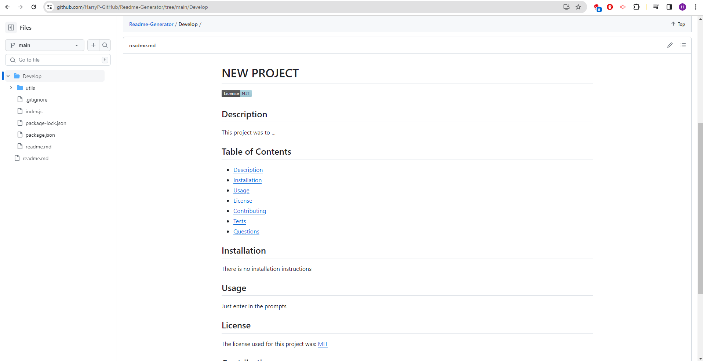

# ReadMe Generator

## Description
This project was to develop a readme generator which would use Node.js to prompt the user to provide input to generate the readme. The readme will contain the following sections title, license badge (if necessary), description, table of contents, installation, usage, license, contributing, tests and questions. Use as much detail as necessary to create a professional readme for your projects.

## Installation
If you have copied over the repository you may need to install Node.js + Dependencies
To install dependencies, in the integrated terminal run:
npm install

## Usage
To use this project, in the integrated terminal type in 
node index.js 

This will prompt you to answer the questions provided. It will then create a readme file from your input. The project will require you to provide a title, installation instructions, list of contributors/resources, Usage instructions, Tests with instructions, license, GitHub username and contact email. You can fill in the sections with as much detail necessary. When you submit all your input the readme, named readme.md, will be generated and stored within the Develop folder, separate from this projects readme.

## Credits
Many Internet Resources 
Teachers/Class Material + Tom's help with License question
The Full-Stack Blog Professional Readme Guide: https://coding-boot-camp.github.io/full-stack/github/professional-readme-guide
GitHub Licensing info: https://docs.github.com/en/repositories/managing-your-repositorys-settings-and-features/customizing-your-repository/licensing-a-repository
How To Create Interactive Command-line Prompts with Inquirer.js by joshtronic: https://www.digitalocean.com/community/tutorials/nodejs-interactive-command-line-prompts
shields.io: https://shields.io/badges
lukas-h markdown license badges: https://gist.github.com/lukas-h/2a5d00690736b4c3a7ba
opensource.org licenses: https://opensource.org/licenses/
boost.org for BSL license: https://www.boost.org/LICENSE_1_0.txt
gnu.org for GPL license: https://www.gnu.org/licenses/gpl-3.0
The Full-Stack Blog Video Submission Guide: https://coding-boot-camp.github.io/full-stack/computer-literacy/video-submission-guide

## License
N/A

## GitHub Repository

[GitHub Repository](https://github.com/HarryP-GitHub/Readme-Generator)

## Video Demo

[Video Demo](https://drive.google.com/file/d/1uE5cN_87KnsE4Uwm7Q7rEuKxW4ENeKsJ/view)

This is how an example of a generated readme will look on GitHub

